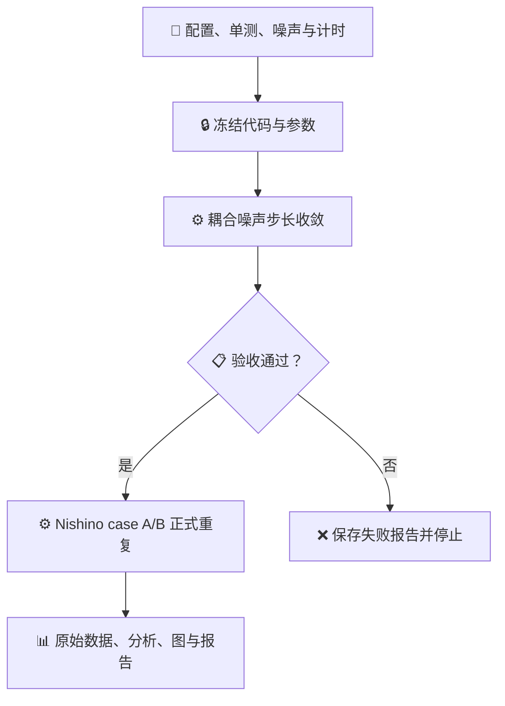

# 按文献归档与约化 LLG

_目录说明；2026-09-10 更新，R0 历史流程保留_

---

## 📋 当前范围

2026-09-10 已按后续指令补入 R2–R5 关键模型、弱 RK、运行与分析入口。最新范围、测试和未解决项以[实现交接记录](LITERATURE_IMPLEMENTATION_20260910.md)为准；可运行不等于正式文献复现通过，生产开关仍关闭。

以下为 2026-09-09 初始 R0 范围与历史流程说明，不表示后续实现仍被禁止：

[当前计划](GUIDE/STRICT_LITERATURE_REPRODUCTION_PLAN.md)第 13 节要求本轮只执行 R0：
建立纯约化内核、迁移 Nishino、通过前置测试后清理旧 Nishino 并重跑。
其他四篇的既有材料已分类，YAML 是候选配置，不能当作严格复现已完成。
本轮不启动模型训练或正式训练数据集生成。

## 📦 按文献检查

每个 paper_id 使用同一套目录：

| 内容 | 路径 |
| --- | --- |
| 参数与换算 | `conf/literature/<paper_id>.yaml` |
| 模型、运行、分析、绘图代码 | `scripts/literature/<paper_id>/` |
| 原文、图与来源记录 | `data/literature_reproduction/<paper_id>/reference/` |
| 不可修改原始数据 | `data/literature_reproduction/<paper_id>/raw/<run_id>/` |
| 分析产生的数据 | `data/literature_reproduction/<paper_id>/derived/<run_id>/` |
| PNG 图与 GIF 动画 | `assets/literature_reproduction/<paper_id>/<run_id>/` |
| 验收、配置/数据散列清单 | `output/literature_reproduction/<paper_id>/<run_id>/` |
| 服务器日志 | `logs/literature_reproduction/<paper_id>/<run_id>/` |
| 实际运行冻结参数 | `conf/frozen/<paper_id>/<campaign>/` |

output 中的 logs 是到根目录 logs 的相对软链接，不重复保存日志。
旧资料使用 `legacy_before_reduced_20260909`，旧实现使用 `legacy_*.py`。
旧路径兼容入口只保留导入/命令转发，不是正式计算入口。
[迁移清单](LITERATURE_DIRECTORY_MIGRATION.json)记录逐文件原地址、新地址、字节数与 inode。
混合了多篇文献的旧汇总图放在 `cross_paper_legacy`，不冒充某一篇的独立结果。
原始历史 JSON/HDF5 内的旧路径不改写，可用 `resolve_recorded_path` 解析。

| paper_id | 现有内容及限制 |
| --- | --- |
| nishino_miyashita_2015 | 新约化 model/run/analyze/plot；原文与勘误；R0 门控重跑 |
| bauer_2011 | 开放链、弱 RK、删失统计、拟合入口；原时长统计尚未运行 |
| hirst_mn2au_2022 | 三维 ASD、AFM-LLB、AFMR/固定端面壁；待独立邻接与正式数值审计 |
| gomonay_2024 | 约化双层与旋转长条、sinc/FFT/自由壁；待正式收敛与逐点比较 |
| laliena_crnb3s6_2020 | 修正 BVP、电流 LLG、延拓；临界值差异未解决 |

## ⚙️ 参数边界

YAML 的四层是 `source_parameters → reduction → reduced`，另有 `numerics`。
Pint 在输入边界检查量纲和换算；运行对象仅暴露 reduced/numerics。
新内核 `scripts/core/reduced_llg.py` 不含材料常数或实际单位。
新增材料应实现无量纲 energy/field 接口；几何和邻接属于材料模型，
不属于通用积分器。有效场必须通过负梯度检查。

旧 `unified_llg.py` 和旧 V2 数据/模型仍保留，以维持历史模型的可解释性；
它们没有被静默转换，也不属于新约化生产入口。尚未迁移的旧论文实现
明确标为 legacy，不能据此声称整个历史项目已全部无量纲化。

## 🔄 自动任务链与停止规则



一个 fat 作业内最多 20 个单线程进程，任务名为 `zrs-mag`。
先做 96 个独立收敛任务；只有通过全部必要门槛，才执行 240 个正式重复任务。
每个收敛任务比较显式中点、Heun、几何中点与三个耦合步长。
正式主方法依据原文 Appendix B 的显式中点，而不是把几何中点冒称原文方法。[^1]
归一化前误差保留；报告区分项目增加的最终投影与原文算法。
原文与 2018 勘误均已检查，勘误不改变本轮 Fig.1 的参数与算法目标。[^2]

每组完整原始文件通过身份、完整性和散列检查后才从 `.partial` 原子改名。
分析只读 raw；绘图只读 derived/reference。失败数据不筛除；不自动改温度、
阻尼、尺寸、观测时间或阈值。整个 95% CI 必须落在预设容差内。
相关时间帧不作为独立样本；CDF 额外使用独立终态样本与 Holm 校正。

正式提交后无需人工持续监督：任务链自行执行或按门槛停止。
用户报告任务完成后，再进行下一轮检查。没有通过 R0/Nishino 时，
其余有限温生产、R2–R5 和训练数据生成保持关闭。

## 🔧 手工检查入口

从项目根目录运行，所有 Python 命令均通过 zrs-mag：

```bash
bash ../run_zrs_mag.sh scripts/config/validate_literature_configs.py
bash ../run_zrs_mag.sh -m pytest scripts/tests -q
```

提交前准备脚本是 `scripts/workflow/prepare_reduced_campaign.py`；
它会重新运行测试、验证 fat 上的计时/噪声记录、生成只读代码快照并计算 walltime。
它本身不提交、不删除。实际批处理入口是 `slurm/reduced_literature_r0.sbatch`。
清理脚本严格限定 GUIDE 中三个旧 Nishino 目标，要求新作业先以 held 状态获服务器接受，
并逐文件确认旧数据与 Git/LFS 历史一致，保存清单后才允许删除。

## 🔗 文献与实施依据

本轮采用单位换算技能进行边界校验，采用统计技能区分独立磁矩与相关时间帧，
采用 matplotlib 与文档技能生成可审计图表及目录说明。
具体代码与证据以各次 preparation、manifest、report 和冻结快照为准。

[^1]: Nishino and Miyashita (2015), Phys. Rev. B 91, 134411. https://doi.org/10.1103/PhysRevB.91.134411
[^2]: Nishino and Miyashita (2018), Erratum, Phys. Rev. B 97, 019904. https://doi.org/10.1103/PhysRevB.97.019904

